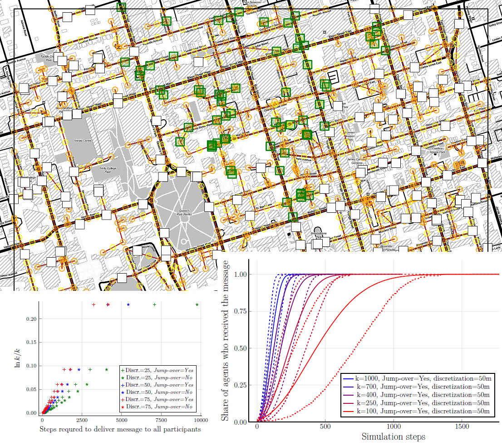

# SignalBroadcastingSim.jl
Repository accompanying the paper:

*On Broadcasting Time in the Model of Travelling Agents*

by Reaz Huq, Bogumił Kamiński, Atefeh Mashatan, Paweł Prałat, Przemysław Szufel


| **Documentation** | **Build Status** |
|---------------|--------------|
|[![][docs-latest-img]][docs-dev-url] | [![Build Status][travis-img]][travis-url]  <br/> Linux and macOS |

## Documentation


- [**DEV**][docs-dev-url] &mdash; **documentation **

[docs-latest-img]: https://img.shields.io/badge/docs-latest-blue.svg
[docs-dev-url]: https://travis-ci.org/pszufe/SignalBroadcastingSim.jl/dev
[docs-stable-url]: https://travis-ci.org/pszufe/SignalBroadcastingSim.jl/stable

[travis-img]: https://travis-ci.org/pszufe/SignalBroadcastingSim.jl/.svg?branch=master
[travis-url]: https://travis-ci.org/pszufe/SignalBroadcastingSim.jl/


We consider the following broadcasting process run on a connected graph . 
Suppose that  agents start on vertices selected from *V* uniformly and independently at random. One of the agents has a message that she wants to communicate to other agents. All agents perform independent random walks on *G*, and each time an agent that knows the massage meets another agent the message is passed along. The broadcasting time  is the time it takes to spread the message to all agents.

Our ultimate goal is to gain a better understanding of the broadcasting process run on real-world networks of roads of a large city that might shed some light on the behavior of future autonomous and connected vehicles. Due to the complexity of road networks, in practical applications such phenomena have to be studied using simulation. In this paper, we study the process on the simplest scenario, the family of complete graphs, as in this case the problem is analytically traceable. We provide tight bounds for  that hold asymptotically almost surely for the whole range of the parameter . These theoretical results reveal interesting relationships and, at the same time, are also helpful to understand and explain the behavior we observe for more realistic networks.


Running experiments in a distributed environment:
```bash
julia -p 96 experiments.jl
```

Visualizing the results:
```julia
julia plot_res.jl
julia plot_res_end.jl
julia plot_single_sim.jl
```

Sample results:

